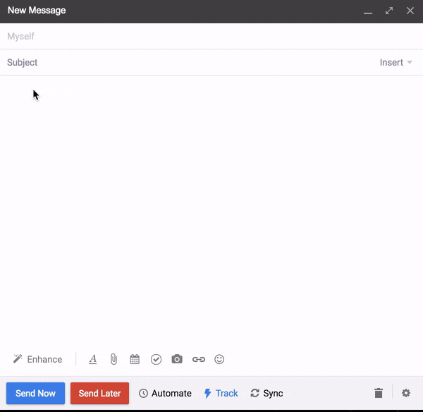

# weather-slash-command

## What is weather-slash-command?
 > A Mixmax slash command that returns the current weather for any city
 


# Weather Icons Credit
Icons made by [Pixel-Buddha](http://www.flaticon.com/authors/pixel-buddha "Pixel-Buddha's Homepage") from www.flaticon.com

## Installation steps

#### Environment dependencies
Install node on Ubuntu server (Assumption: Ubuntu 16.04.1 x64 distribution):
```sh
# Node.js v7 installation on Digital Ocean droplet
curl -sL https://deb.nodesource.com/setup_7.x | sudo -E bash -
sudo apt-get install -y nodejs
```

Set environment variables:
```sh
# open the following file
nano ~/.bashrc
# add the following lines of code to set environment variables
export OPEN_WEATHER_MAP_KEY=<insertKey>
export PORT='443'
# force session to read file
source ~/.bashrc
```

#### Clone project
Clone repo from github:
```sh
# run git clone
git clone https://github.com/juliusbuckley/weather-slash-command.git
```

#### Project dependencies

Install project dependencies and transpile server folder:
```sh
# run install script
npm install
```

## Running the Application

#### Local development

Install nodemon for dev environment or update npm dev:start script to use node:
```sh
# install nodemon globally 
npm install -g nodemon
```

Start server and transpile with babel-cli:
```sh
# run dev start script
npm run dev:start
```
#### Production

Start server: 
```sh
# run prod start script
npm start
```

## Testing

### Route testing

Confirm routes are working properly and returing Status Code 200

Start server for testing: 
```sh
# run test script
npm test
```
